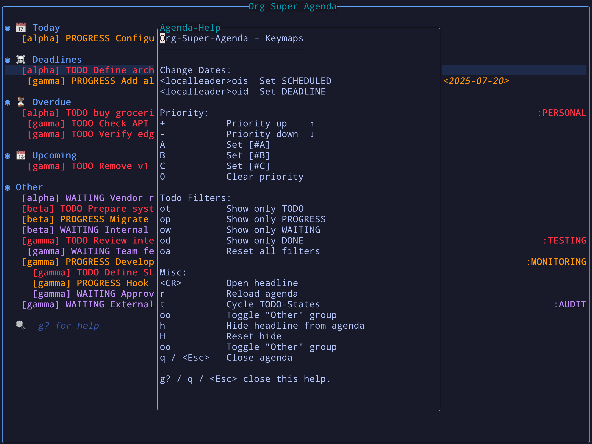
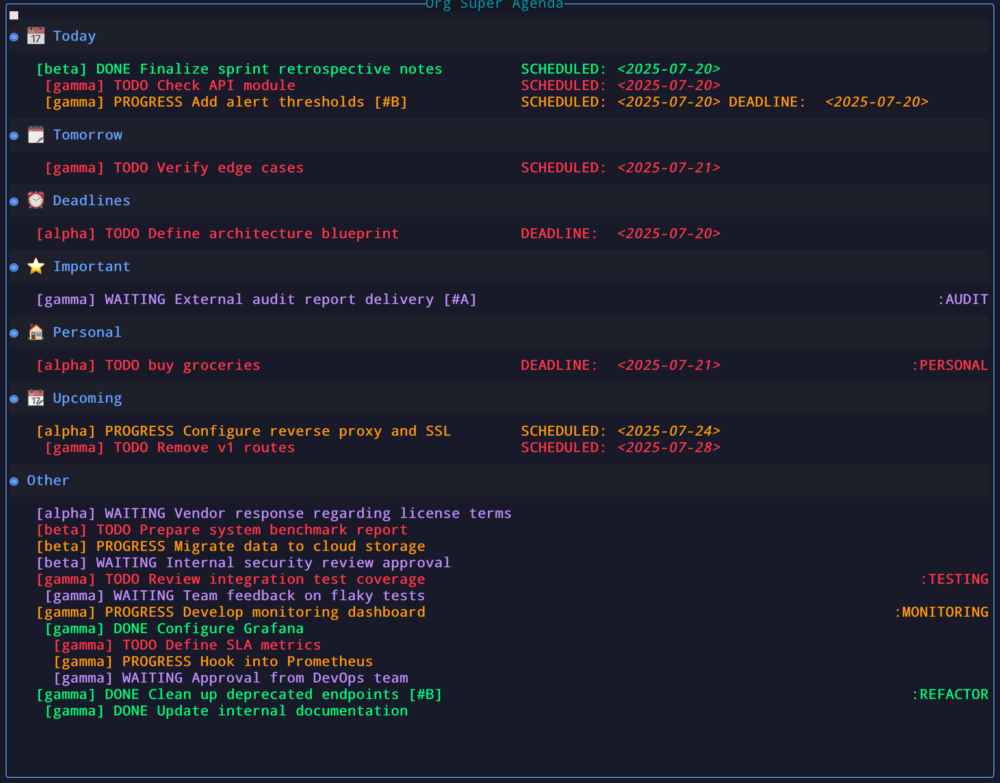

# org-super-agenda.nvim




A Neovim plugin inspired by [org-super-agenda](https://github.com/alphapapa/org-super-agenda) for Emacs. Organize your org-mode agenda into smart, configurable groups — fast, keyboard-driven, and safe-by-design.

---

## ✨ Features

* **One command**: `:OrgSuperAgenda` — no buffers polluted
* **Fullscreen mode**: `:OrgSuperAgenda fullscreen` *or* `:OrgSuperAgenda!`
* **Centered float** with configurable size & border
* **Smart groups**: Today, Tomorrow, Overdue, Upcoming, Important, Personal/Work, and **anything you script**
* **Per-section sorting** (with global fallback)
* **Live filtering**: exact (`of`), fuzzy (`oz`), and **advanced query** (`oq`)
* **Quick TODO filters** via per‑state keymaps (e.g. `ot`, `op`, `ow`, `od`)
* **Inline editing** for TODO, priority, scheduled & deadline
* **Priority tools**: `A`, `B`, `C`, `+`, `-`, `0`
* **Preview headline** (`K`), **open** (`<CR>`), **refile** (`R`)
* **Hide item** (`x`) / **reset hidden** (`X`) with optional persistence
* **Undo last change** (`u`) within the agenda
* **Toggle duplicates** across groups (`D`)
* **Switch view** between `classic` and `compact` (`ov`)
* **Right‑aligned tags**, customizable header format, and filename display
* **Safety**: refuses edits when a swapfile is present or buffer is modified elsewhere
* **Sticky DONE**: items marked DONE during the session remain visible until you close the window

---

## 🚀 Commands

* `:OrgSuperAgenda` — open the agenda (float)
* `:OrgSuperAgenda fullscreen` **or** `:OrgSuperAgenda!` — open fullscreen

Convenient mappings:

```lua
vim.keymap.set('n', '<leader>oa', '<cmd>OrgSuperAgenda<cr>')
vim.keymap.set('n', '<leader>oA', '<cmd>OrgSuperAgenda!<cr>') -- fullscreen
```

---

## 📦 Installation (lazy.nvim)

```lua
return {
  'hamidi-dev/org-super-agenda.nvim',
  dependencies = {
    'nvim-orgmode/orgmode', -- required
    { 'lukas-reineke/headlines.nvim', config = true }, -- optional nicety
  },
  config = function()
    require('org-super-agenda').setup({
      -- Where to look for .org files
      org_files           = {},
      org_directories     = {}, -- recurse for *.org
      exclude_files       = {},
      exclude_directories = {},

      -- TODO states + their quick filter keymaps and highlighting
      todo_states = {
        { name='TODO',     keymap='ot', color='#FF5555', strike_through=false, fields={'filename','todo','headline','priority','date','tags'} },
        { name='PROGRESS', keymap='op', color='#FFAA00', strike_through=false, fields={'filename','todo','headline','priority','date','tags'} },
        { name='WAITING',  keymap='ow', color='#BD93F9', strike_through=false, fields={'filename','todo','headline','priority','date','tags'} },
        { name='DONE',     keymap='od', color='#50FA7B', strike_through=true,  fields={'filename','todo','headline','priority','date','tags'} },
      },

      -- Agenda keymaps (inline comments explain each)
      keymaps = {
        filter_reset      = 'oa', -- reset all filters
        toggle_other      = 'oo', -- toggle catch-all "Other" section
        filter            = 'of', -- live filter (exact text)
        filter_fuzzy      = 'oz', -- live filter (fuzzy)
        filter_query      = 'oq', -- advanced query input
        undo              = 'u',  -- undo last change
        reschedule        = 'cs', -- set/change SCHEDULED
        set_deadline      = 'cd', -- set/change DEADLINE
        cycle_todo        = 't',  -- cycle TODO state
        reload            = 'r',  -- refresh agenda
        refile            = 'R',  -- refile via Telescope/org-telescope
        hide_item         = 'x',  -- hide current item
        preview           = 'K',  -- preview headline content
        reset_hidden      = 'X',  -- clear hidden list
        toggle_duplicates = 'D',  -- duplicate items may appear in multiple groups
        cycle_view        = 'ov', -- switch view (classic/compact)
      },

      -- Window/appearance
      window = {
        width        = 0.8,
        height       = 0.7,
        border       = 'rounded',
        title        = 'Org Super Agenda',
        title_pos    = 'center',
        margin_left  = 0,
        margin_right = 0,
        fullscreen_border = 'none', -- border style when using fullscreen
      },

      -- Group definitions (order matters; first match wins unless allow_duplicates=true)
      groups = {
        { name = '📅 Today',     matcher = function(i) return i.scheduled and i.scheduled:is_today() end, sort={ by='priority', order='desc' } },
        { name = '🗓️ Tomorrow', matcher = function(i) return i.scheduled and i.scheduled:days_from_today() == 1 end },
        { name = '☠️ Deadlines', matcher = function(i) return i.deadline and i.todo_state ~= 'DONE' and not i:has_tag('personal') end, sort={ by='deadline', order='asc' } },
        { name = '⭐ Important',  matcher = function(i) return i.priority == 'A' and (i.deadline or i.scheduled) end, sort={ by='date_nearest', order='asc' } },
        { name = '⏳ Overdue',    matcher = function(i) return i.todo_state ~= 'DONE' and ((i.deadline and i.deadline:is_past()) or (i.scheduled and i.scheduled:is_past())) end, sort={ by='date_nearest', order='asc' } },
        { name = '🏠 Personal',   matcher = function(i) return i:has_tag('personal') end },
        { name = '💼 Work',       matcher = function(i) return i:has_tag('work') end },
        { name = '📆 Upcoming',   matcher = function(i)
            local days = require('org-super-agenda.config').get().upcoming_days or 10
            local d1 = i.deadline  and i.deadline:days_from_today()
            local d2 = i.scheduled and i.scheduled:days_from_today()
            return (d1 and d1 >= 0 and d1 <= days) or (d2 and d2 >= 0 and d2 <= days)
          end,
          sort={ by='date_nearest', order='asc' }
        },
      },

      -- Defaults & behavior
      upcoming_days      = 10,
      hide_empty_groups  = true,      -- drop blank sections
      keep_order         = false,     -- keep original org order (rarely useful)
      allow_duplicates   = false,     -- if true, an item can live in multiple groups
      group_format       = '* %s',    -- group header format
      other_group_name   = 'Other',
      show_other_group   = false,     -- show catch-all section
      show_tags          = true,      -- draw tags on the right
      show_filename      = true,      -- include [filename]
      heading_max_length = 70,
      persist_hidden     = false,     -- keep hidden items across reopen
      view_mode          = 'classic', -- 'classic' | 'compact'

      classic = { heading_order={'filename','todo','priority','headline'}, short_date_labels=false, inline_dates=true },
      compact = { filename_min_width=10, label_min_width=12 },

      -- Global fallback sort for groups that omit `sort`
      group_sort = { by='date_nearest', order='asc' },

      -- Popup mode: run in a persistent tmux session for instant access
      popup_mode = {
        enabled      = false,
        hide_command = nil, -- e.g., "tmux detach-client"
      },

      debug = false,
    })
  end,
}
```

---

## 🔢 Sorting (per-section & global)

Supported sort keys:

* `date_nearest` (min of days-to-deadline/scheduled; missing → ∞)
* `deadline`, `scheduled` (days from today)
* `priority` (A > B > C)
* `todo` (order of your `todo_states`)
* `filename`, `headline`

Tie‑breakers: **priority desc**, then filename asc, then headline asc.

Examples:

```lua
-- Global default
group_sort = { by = 'date_nearest', order = 'asc' }

-- Per group override
{ name = '☠️ Deadlines', matcher = m_deadlines, sort = { by = 'deadline', order = 'asc' } }
```

---

## 🔍 Filtering & Advanced Query

### Quick filters

* **Exact text**: `of` → type to filter; ESC/Enter to stop
* **Fuzzy text**: `oz` → same but fuzzy
* **Reset**: `oa`
* **Per‑state**: `ot` / `op` / `ow` / `od` (customizable)

### Query language (`oq`)

Tokens (space-separated):

```
tag:work|home      # must have any of these tags
-file:archive      # (negated) exclude if filename contains substring
file:notes         # filename contains substring
 todo:TODO|WAITING # limit to TODO states
 prio>A            # A is highest (A > B > C); also: prio:A
 due<3             # deadline in < 3 days (relative)
 sched>=0          # scheduled today or later
 before:2025-12-31 # deadline before absolute date
 after:2025-08-01  # scheduled after absolute date
 is:overdue        # scheduled/deadline in the past
 is:done           # DONE items only
 words here        # free-text includes (AND)
 -noise            # free-text excludes
```

Examples:

```
# A-priority work due soon
prio:A tag:work due<5

# Upcoming personal, not waiting
tag:personal -WAITING sched>=0
```

---

## 🧭 View modes

* **classic**: headline prefix `[filename] TODO [#A] Title …` with inline or separate date line
* **compact**: fixed columns for filename and date label (`Sched. in 3 d.:`), right-aligned tags

Switch with `ov` (or set `view_mode` in config).

---

## 📤 Refile (Telescope + org-telescope)

* Hit `R` on an item to open a picker
* Toggle between **file** and **headline** targets with `<C-Space>`
* Segment is moved and auto-reloaded in any open buffers

---

## 🪟 Popup Mode (tmux integration)

Run OrgSuperAgenda in a dedicated tmux session for instant access. When enabled, pressing `q` hides the session instead of closing the buffer.

```lua
popup_mode = {
  enabled      = true,
  hide_command = "tmux detach-client",
}
```

You can bind a tmux key to toggle the popup session for quick agenda access.

---

## ⚠️ Safety & behavior details

* Will **refuse to edit** if the buffer is modified in Neovim or a **swapfile** is detected (likely open elsewhere)
* **Sticky DONE** items remain visible in a dedicated section until the window is closed
* “Other” section **never** collects DONE items by design
* Hidden items respect `persist_hidden`

---

## 🤝 Contributing

PRs, issues, discussions welcome.

## 📄 License

MIT License

